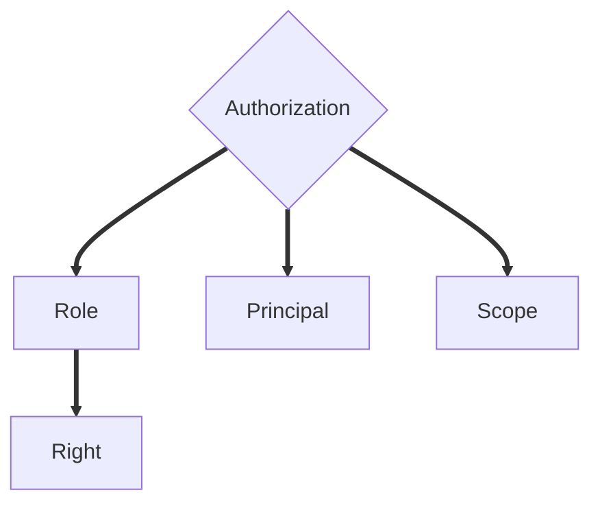
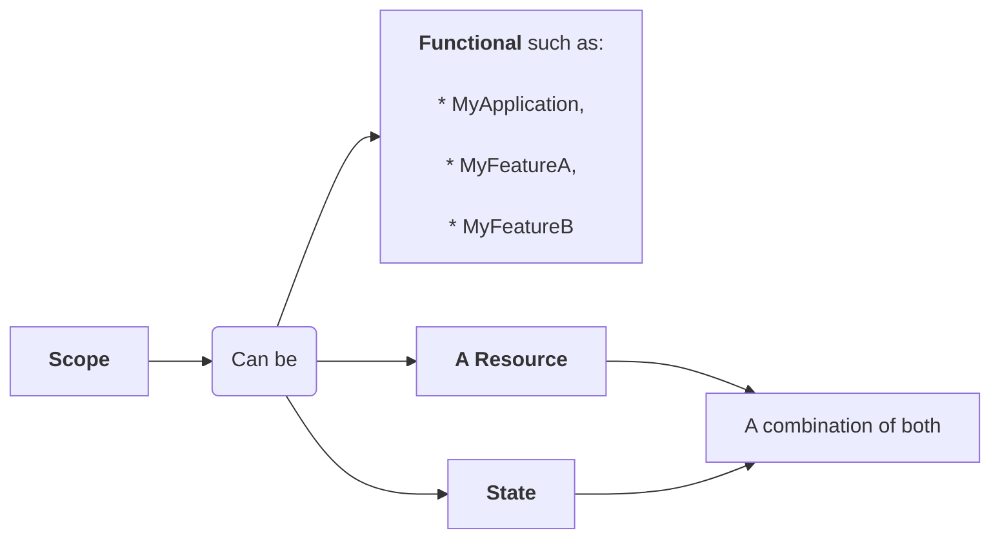
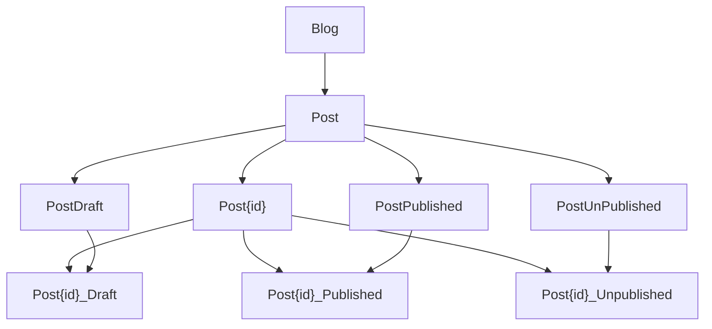

# Core concepts

## Principal
The **Principal** is the **security context** under which a code is executing. So It might be an authenticated Service, User or Group



## Role

A role is a set of **Rights**.

> Note: This concept is technical and differs from functional roles. See sample below.

## Scope

A **scope** is a named **perimeter** upon which we will give authorizations. 

Scope might have parent child relation with other scopes.

Note that Scope names must be globally unique, so naming strategy is of essence.



## Authorization

An Authorization is the attribution of a Role to a Principal on a Scope. 

If a Scope has child scopes, the Authorization will automatically apply to them.


# Example

Let say we are handling rights over a blog with the following fuctional requirements:

* Post states:
    * **Draft**: 
    ```mermaid
    graph LR
        Draft[Draft] -- publish --> Pub[Published]
        Pub -- unpublish --> Unpub[Unpublished]
        Unpub -- republish --> Pub
    ```

* Functional Roles:
    * **Blog Administrator**: has every rights (create/view/edit/delete)
    * **Blog Moderator**: has create/view/edit/publish/unpublish/republish rights on all blog posts
    * **Blog Writer**: has create rights, can view all posts but can only edit and publish his own posts. He can't republish
    * **Guest Writer**: has create rights, can view all published posts but can only edit his own posts
    * **Blog Reader (Anonymous)**: has view rights on all published posts


## Rights

* `createPost` : Can create a new post
* `viewPost` : Can view a post
* `editPost`: Can edit a post
* `deletePost` : Can delete a post
* `publishPost` : Can transition a post from draft to published statePost
* `unpublishPost` : Can transition a post from published to unpublished state
* `republishPost` : Can transition a post from unpublished to published

## Scope model



## Role Model

* PostDitcher : `deletePost`
* PostModerator:  `unpublishPost`, `republishPost`
* PostPublisher: `publishPost`
* PostCreator: `createPost`
* PostEditor: `editPost`
* PostReader: `viewPost`

## Functional Role Mapping

* Administrator: 
    * `PostDitcher` | `PostModerator` | `PostPublisher` | `PostCreator` | `PostEditor` | `PostReader` on Scope `Blog`
* Moderator:
    * `PostModerator` | `PostPublisher` | `PostCreator` | `PostEditor` | `PostReader` on Scope `Blog`
* Writer:
    * `PostCreator` | `PostReader` on Scope `Blog`
    * `PostEditor` | `PostPublisher` On all his `Post{id}` Scopes
* Guest Writer:
    * `PostCreator` on Scope `Blog`
    * `PostReader` on Scope `PostPublished`
    * `PostEditor` | `PostReader` On all his `Post{id}` Scopes
* Reader (Anonymous):
    * `PostReader` on Scope `PostPublished`

## Usage

Check if the current principal can read a blog post:

1. Compute current narrowest Post Scope based on its Id and State. ex for `id = 1` and `state = Draft` : `Post1_Draft`.
2. Query using IAuthorizationClient
    ```csharp
    public class PostController: Controller 
        private IAuthorizationClient authorizationClient;

        public PostController(IAuthorizationClient authorizationClient) {
            this.authorizationClient = authorizationClient;
        }

        [HttpGet("{id}")]
        public IActionResult Get(int id){
            var post = GetPost();

            if (!this.authorizationClient.HasRightOnScopeAsync("viewPost", $"Post{post.Id}_{post.State}")) {
                return Forbidden("You don't have the rights to view this post.");
            } 

            // Hooray ! Let's display something
        }
    }
    ```

